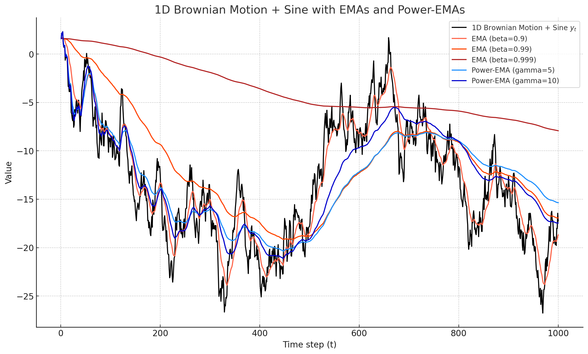
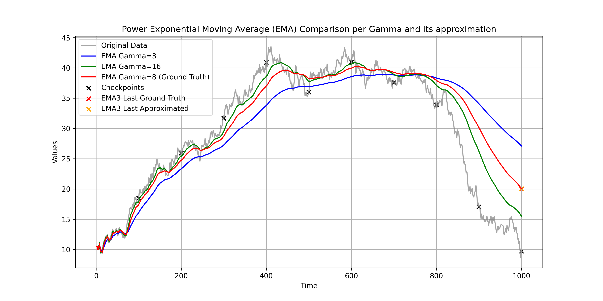

# Karras Power Function EMA (Post-training EMA synthesis)

This tutorial-repo implements the Karras's Power function EMA, quite incredible trick introduced in the paper [Analyzing and Improving the Training Dynamics of Diffusion Models](https://arxiv.org/abs/2312.02696v1) by Tero Karras, Miika Aittala, Jaakko Lehtinen, Janne Hellsten, Timo Aila, Samuli Laine.


# So What is Karras's Power function EMA?

I recommend you to read the paper for full detail, but here is the big picture.

Recall that EMA'ing checkpoint is about keeping track of smooth-version of model parameters, $\theta_\beta$, where $\theta_\beta(t) = \beta \theta_\beta(t-1) + (1-\beta) \theta(t)$

, where $\beta$ is the decaying factor close to 1. Using EMA typically makes the model more robust, and it is a common practice in training deep neural networks.


You want to use EMA, but...

1. You *don't* want the ema to be too slow, because it will make random initialization's contribution to the final model too big.
2. You definitely want the decaying factor to be self-similar, because you should be able to *increase-time* of the training.
3. You want to set decaying factor *post-hoc*, because you don't want to retrain the model from scratch with different decaying factor.

Karras's Power function EMA is the answer to all of these problems. He first uses power-function version of EMA where instead of keeping beta constant, he uses $\beta(t) = (1 - 1/t)^{1 + \gamma}$, where $\gamma$ is the hyperparameter. This makes the contribution of historical parameters self-similar, and you can increase the time of the training and it will not change how you expect the EMA to behave (i.e., if you want first 10% of the training to contribute x% of the final model, increasing/decreasing training time will not change that).

# Overall Algorithm and Implementation

So there is two main part of the algorithm.

1. Saving two copies of the EMA-model, each with different width.
2. Recovering arbitrary-width EMA

Think of width as decaying factor. Larger width means it will be *smoother*.



## First, save two copies of the EMA, with different width

This is the easy part. You just need to save two copies of the EMA, each with different width (different $\gamma$).

```python
gamma_1 = 5
gamma_2 = 10
model = Model()
model_ema_1 = copy.deepcopy(model).cpu()
model_ema_2 = copy.deepcopy(model).cpu()


for i, batch in enumerate(data_loader):
    beta_1 = (1 - 1/(i+1)) ** (1 + gamma_1)
    beta_2 = (1 - 1/(i+1)) ** (1 + gamma_2)
    # train model
    loss.backward()
    optimizer.step()
    for p, p_ema_1, p_ema_2 in zip(model.parameters(), model_ema_1.parameters(), model_ema_2.parameters()):
        p_ema_1.data = p_ema_1.data * beta_1 + p.data * (1 - beta_1)
        p_ema_2.data = p_ema_2.data * beta_2 + p.data * (1 - beta_2)
    
    if i % save_freq == 0:
        torch.save(model_ema_1.state_dict(), f'./model_ema_1_{i}.pth')
        torch.save(model_ema_2.state_dict(), f'./model_ema_2_{i}.pth')

```


## Second, recover arbitrary-decay EMA after training.

Now what if you want to recover EMA with $\gamma_3$? Incredibly, you can do this with all the saved checkpoints. The math behind this in the paper is bit... *not straightforward* so here is my version of the explanation.

EMA, by definition, can be considered as integral of trajectory of the model parameters. So if you have some weighting function $w(t)$, such that

$$\theta_e(T) = \int_0^t w(t) \theta(t) dt$$

For a fixed training runs, $t \in [0, T]$, because we saved two copies of EMA for every, say, total of $n$ checkpoints for different $\gamma$ this means we know the integral value of the trajectory of the

$$\theta_{i,j} = \int_0^T w_{i, j}(t) \theta(t) dt$$

for $i = 1, 2$ and $j = 1, 2, \cdots, n$. $i$ correponds to different width, $j$ corresponds to $j$ th checkpoint. Notice how

$$
w_{i, j}(t) = \begin{cases} 
t^{\gamma_i} / g_{i,j} & \text{if } t < j \\
0 & \text{otherwise}
\end{cases} $$

where $g_{i,j}$ is simply the normalization constant to make $\int_0^T w_{i, j}(t) dt = 1$.

Our goal is then to 

1. find a approximate $\hat{w}_3(t)$ that will give us the EMA that corresponds with $\gamma_3$.

2. find the correpsonding $\theta_{3,T}$

See where this is going? Our goal is to approximate $w_3(t)$ as linear combination of $w_{1, j}(t)$ and $w_{2, j}(t)$, i.e.,

$$w_3(t) = \sum_{j=1}^n \alpha_j w_{1, j}(t) + \beta_j w_{2, j}(t)$$

where $\alpha_j$ and $\beta_j$ are the coefficients we need to find. This way,


$$\theta_{3,T} = \int_0^T w_3(t) \theta(t) dt = \sum_{j=1}^n \alpha_j \theta_{1, j} + \beta_j \theta_{2, j}$$

Aha! Now we can find $\alpha_j$ and $\beta_j$ by solving the linear system of equations. Let's just take this one step further.

## Goal let us project $w_3(t)$ onto the subspace spanned by $w_{1, j}(t)$ and $w_{2, j}(t)$

We have $K$ functions $f_k(t)$, we have a target $g(t)$ and we want to find $k$ coefficients $\alpha_i$ such that

$$\min \int_0^T \left( g(t) - \sum_{i=1}^K \alpha_i f_i(t) \right)^2 dt$$

How would you solve this? 

Define inner product as

$$\langle f, g \rangle = \int_0^T f(t) g(t) dt$$

Then we can rewrite the problem as

$$\min \left \| g - \sum_{i=1}^K \alpha_i f_i \right \|_2^2$$

if we define $\| f \|_2 = \sqrt{\langle f, f \rangle}$, expanding the norm, we get

$$
\min \left \| g \right \|_2^2 - 2 \sum_{i=1}^K \alpha_i \langle g, f_i \rangle + \sum_{i=1}^K \sum_{j=1}^K \alpha_i \alpha_j \langle f_i, f_j \rangle
$$

Ha, so substituting $A_{i,j} = \langle f_i, f_j \rangle$ and $b_i = \langle g, f_i \rangle$, we actually just had linear least square problem!

$$\min \left \| g \right \|_2^2 - 2 \alpha^T b + \alpha^T A \alpha$$

where $\alpha = (\alpha_1, \cdots, \alpha_K)^T$.

So the solution is simply

$$\alpha = A^{+} b$$

where $A^{+}$ is the pseudo-inverse of $A$. We are left to just use the $\alpha$ to get $\theta_{3,T}$.

> Note : Well if you ever studied functional analysis, you realize hey, *there exists unique solution* to this problem, via *Hilbert's Projection Theorem*. The above is simply finding the projection of $g$ onto the subspace spanned by $f_i$, in $L^2$ space.

So thing you learned:

1. The level of approximation is determined by the number of checkpoints you saved. More checkpoints, better approximation.
2. This doesn't have to be power-function EMA. You can use any weighting function $w(t)$, as long as you can compute the integral of the trajectory of the model parameters.

# I don't care about the math just give me the code?

Ok, but reminder this is just for a power-function EMA. You can use this for any weighting function $w(t)$.

In the above code, you saved two copies of EMA, each with different $\gamma$. Now you want to recover EMA with $\gamma_3$. Suppose you saved $n$ checkpoints, at iteration $i_1, i_2, \cdots, i_n$. Then you can do the following.

```python
t_checkpoint = t[checkpoint_index]
    
ts = np.concatenate((t_checkpoint, t_checkpoint))
gammas = np.concatenate(
    (
        np.ones_like(checkpoint_index) * gamma_1,
        np.ones_like(checkpoint_index) * gamma_2,
    )
)

x = solve_weights(ts, gammas, last_index, gamma_3)
emapoints = np.concatenate((y_t_ema1[checkpoint_index], y_t_ema2[checkpoint_index]))

y_t_ema3 = np.dot(x, emapoints)
```

where `solve_weights` is the function that solves the linear least square problem. You can find the implementation in `solve_weights.py`.

The result is the EMA with $\gamma_3$.

